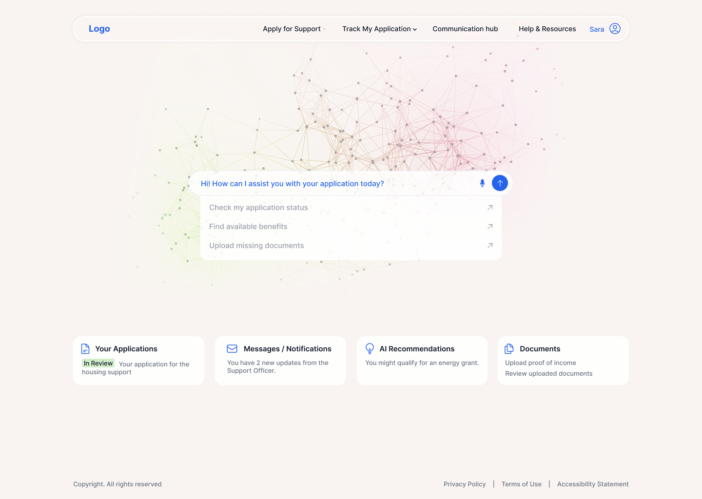

# 🤖 AI Assistant Portal (AI 助手门户)

<div align="center">
  
  
  
  
  
</div>

<br/>

**AI 助手门户 (AI Homepage)** 是一个基于 Vue 3 + Express 构建的企业级现代 AI 助手聚合门户。它可以自动从 **MaxKB** 同步和分类你的 AI 助手，并提供单点登录（OIDC/CAS）、极致的沉浸式聊天体验和美观的响应式前端 UI 设计。

---

## ✨ 功能特性 (Features)

- 🎨 **极致美观的现代化体验**：基于 Tailwind CSS 的精心雕琢，支持流畅的背景效果、响应式布局及全屏沉浸模式，支持拖拽滚动浏览，界面充满质感。
- 🔄 **MaxKB 无缝集成**：完美打通 MaxKB 平台，自动同步 MaxKB 所配置文件夹内的应用和企业工作空间内的 AI 助手，确保数据保持最新。
- 🔐 **企业级身份认证 (SSO/CAS)**：原生集成 Casdoor 等 IAM 身份平台，一键启用 OIDC 和 CAS 单点登录控制，保障数据安全。
- 🌐 **灵活的访问控制**：支持一键开启「访客模式」(PUBLIC_ACCESS)，允许不同层级的受众群体免登录访问应用区。
- ⚡ **开箱即用的容器化**：提供精炼的部署方案并内置 Docker 支持与极简一键部署脚本 `deploy.sh`。

## 🛠️ 技术栈 (Tech Stack)

- **前端 (Frontend)**: Vue 3 (Composition API), TypeScript, Vue Router, Pinia, Tailwind CSS, Lucide Icons
- **后端 (Backend)**: Node.js, Express.js, Axios, openid-client (OIDC), JWT 
- **构建 & 部署 (Build & Deploy)**: Vite, Vue-Tsc, Docker, Nginx, PM2

---

## 🚀 快速开始 (Quick Start)

### 1. 环境准备
- Node.js >= 18.0
- pnpm >= 8.0 (推荐使用 pnpm 管理依赖)
- Docker & Docker Compose (如果你需要生产环境部署)

### 2. 克隆与安装

```bash
# 获取源码并进入项目
cd ai-homepage

# 安装项目所有依赖
pnpm install
```

### 3. 环境配置 

提取一份示例环境文件 `.env.example` 并重命名为 `.env`，按照注释修改核心配置：

```env
# 基础运行环境配置
PORT=3001
JWT_SECRET=your-secure-jwt-secret # 请替换为高强度随机字符串
FRONTEND_URL=http://localhost:5173

# ---- MaxKB 同步配置 ----
MAXKB_API_KEY=your_maxkb_api_key
MAXKB_BASE_URL=https://your-maxkb-domain.com
MAXKB_ROOT_FOLDER=根目录
MAXKB_WORKSPACE_ID=default # 个人/专业版为 default，企业版需填写企业内部的 Workspace ID

# ---- IAM / 单点登录配置 (OIDC 示例) ----
OIDC_ISSUER=https://iam.your-domain.com
OIDC_CLIENT_ID=your_client_id
OIDC_CLIENT_SECRET=your_client_secret
OIDC_REDIRECT_URI=http://localhost:3001/api/auth/callback

# ---- 业务级全局访问控制 ----
# 设置为 true 即可允许所有访客免登录使用所有 AI 助手功能
PUBLIC_ACCESS=false 
```

### 4. 启动开发服务器

同时并行启动前端和后端开发服务器：

```bash
pnpm run dev
```

- **前端 UI 面板**: [http://localhost:5173](http://localhost:5173)
- **后端 API 服务**: [http://localhost:3001](http://localhost:3001)

---

## 🚢 部署与构建 (Deployment)

我们强烈推荐在生产服务器上使用 **Docker** 进行极简部署。

```bash
# 赋予部署脚本最高执行权限
chmod +x deploy.sh

# 一键以 Docker 环境进行构建及部署
./deploy.sh docker
```

除了容器化方案外，若有手动部署 (PM2) 或是通过 Nginx 反向代理绑定域名的需要，详细请查阅和参考 [**部署指南 (DEPLOY.md)**](./DEPLOY.md)。

---

## 📁 核心项目结构 (Structure)

```text
ai-homepage/
├── api/                    # Express 内部后端服务 (Auth, 配置与分发, MaxKB 数据同步)
│   ├── routes/             # RESTful 接口注册
│   └── services/           # 核心业务组件与对接服务
├── src/                    # Vue 3 核心前端代码库
│   ├── components/         # 独立化/复用组件 (功能卡片、交互导览、功能块)
│   ├── pages/              # 顶层视图组件
│   ├── router/             # 全局路由栈规则控制
│   └── styles/             # Tailwind 全局主题和动态背景特效样式 (主题核心)
├── public/                 # 静态资源与构建输出目标
├── docker-compose.yml      # Docker 服务编排剧本
├── Dockerfile              # Docker 节点镜像编译源
└── deploy.sh               # 环境打包发布多用工具 Shell 脚本
```

---

## 📸 运行截图 (Screenshots)

在这里可以看到焕然一新的主界面！充满生机的交互氛围！

<details open>
<summary>点击展开/收起 截图预览</summary>
<br>



</details>

---

## 📜 许可证 (License)

本项目开源授权协议：[MIT License](./LICENSE)

## 🤝 贡献与反馈 (Contributing)

任何关于页面的修改建议、新增特性的脑洞或者是使用中发现的 Bug 问题，都欢迎提交 **Pull Request** 或者开启一个 **Issue**！
如果这个项目让你感觉惊艳，请务必帮我们在 GitHub 点上一颗 ⭐ 感谢鼓励！

## 🙌 特别致谢 (Acknowledgments)

- [Vue.js](https://vuejs.org/) 生态提供核心视图层
- [Tailwind CSS](https://tailwindcss.com/) 塑造极具感染力的基础呈现规范
- [MaxKB (1Panel)](https://github.com/1Panel-dev/MaxKB) 特别感谢强大且直观的 AI 知识库搭建工具！
