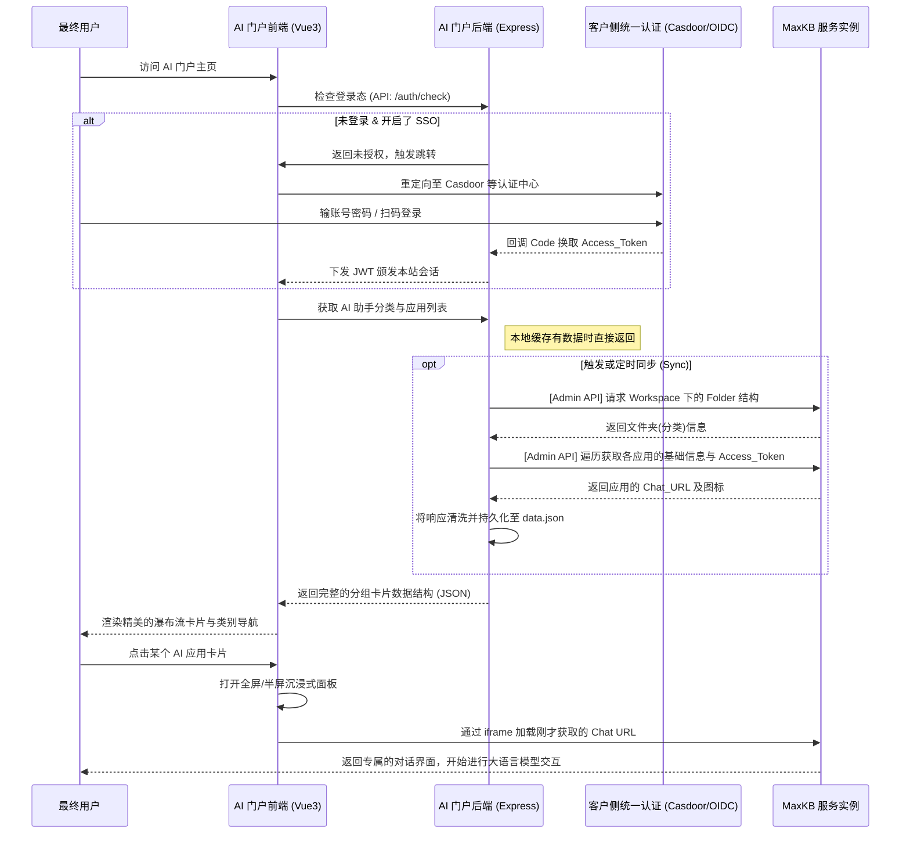

# MaxKB 生态扩展：AI 助手聚合门户 (AI Homepage)

> **文档适用受众**：售前架构师、交付工程师、技术支持
> **文档目的**：对齐 AI 助手门户方案的核心逻辑、功能架构及在 POC/打单 时的应用价值

---

## 一、为什么会有这个项目？（场景痛点）

在跟打单或者给客户做 **MaxKB** 演示时，客户侧经常会提出这样的诉求：

1. **统一入口的缺失**：客户用 MaxKB 配置了人事、财务、IT 等多个大模型助手，但 MaxKB 默认提供的是分散的独立链接。客户希望有一个统一的、高颜值的“公司级大模型导航门户”来把它们聚拢并在一个页面上集中使用。
2. **演示阶段的第一印象**：在 POC 阶段，如果要让客户对项目有更加直观、惊艳的感知，除了底层的知识库和模型能力外，前端 UI 的质感和交互至关重要。
3. **企业级的身份接驳**：客户希望这个入口能直接接管身份，对接企业现有的单点登录（如基于 Casdoor 的 OIDC/CAS 协议），而不是让用户多次登录。

为了解决以上售前打单的痛点，大幅提升我们在客户侧的应用落地表现和“卖相”，我们开发了 **AI Homepage（AI 助手门户）**。

---

## 二、功能特性

本门户是基于 Vue 3 + Tailwind CSS + Express 构建的现代化 Web 应用。

- **动态智能同步 (MaxKB 深度融合)**：系统会通过 MaxKB 的 Admin API，根据设定的【工作空间】与【目标文件夹】，将底下的所有应用读取过来转换为门户的各类菜单和卡片。
- **现代化与沉浸式 UI**：极其吸睛的拟物卡片流配合全屏动效，打开具体应用时直接以沉浸式内嵌（iframe）的形式呈现，无需跳出页面。
- **灵活的统一认证机制 (SSO)**：
  - 支持免登录直接体验的**访客模式 (Public Access)**。
  - 支持 OIDC/CAS 标准协议企业单点登录对接，能平滑集成客户侧现存的 IAM / Casdoor。
- **一键容器化**：提供傻瓜式的 `./deploy.sh docker` 脚手架，在客户测试机上几分钟就能拉起包含前后端的应用栈。

---

## 三、方案功能架构 (核心机制)

项目的核心逻辑围绕着 **“拉取目录 -> 结构化分类 -> 前端绚丽呈现 -> SSO会话保持 -> 无缝内嵌对话”** 展开。

### 1. 它是如何对接 MaxKB 的？

1. **挂载配置**：门户后端加载环境变量（包含 `MAXKB_API_KEY`, `Workspace ID`, 指定的 `根目录文件夹名`）。
2. **获取层级结构**：调用 MaxKB 的 `APPLICATION/folder` 接口，寻找指定的根目录，并以它下面的一级子文件夹作为应用分类。
3. **获取应用和应用令牌**：遍历这些子分类，拿到具体的应用卡片与原始链接。为了确保会话的独立性和安全性，进一步调用 `access_token` 获取接口，为每一个应用生成对应的专属无状态聊天 URL（`${baseURL}/chat/${accessToken}`）与 Icon 资源映射。
4. **渲染展示**：把上述结构化好的数据吐给前端聚合呈现。

### 2. 交互与部署架构图

> 下面的流程图描述了一次完整的用户访问与数据流动链路：



---

## 四、POC 实施与配置指南（一分钟上手）

面向 POC 在现场需要快速出效果的场景，请遵循以下简单动作：

### 1. 准备配置文件

获取项目源码后，复制出一份 `.env` 文件。请重点检查并修改以下这几个变量：

```ini
# (必须) 你的 MaxKB 服务器地址与管理 API Key
MAXKB_BASE_URL=https://your-maxkb-demo-server.com
MAXKB_API_KEY=your_api_key

# (必须) 告诉门户拉取 MaxKB 里面的哪个层级作为起点
MAXKB_ROOT_FOLDER=根目录
# 取决于你的环境配置，专业版为 default，企业版为对应的企业 Workspace ID
MAXKB_WORKSPACE_ID=default 

# (可选) 演示时强烈建议设为 true，这样不用配繁琐的 IAM 就能直接跳过登录屏障使用
PUBLIC_ACCESS=true
```

### 2. 极速拉起服务

确保目标机器装有 Docker 基础环境。

```bash
chmod +x deploy.sh
./deploy.sh docker
```

服务运行后，通过外网 IP 的 `3001` 端口（或经过 Nginx 反代的地址），你就可以把一套具有极佳质感的 AI Homepage 展现给客户了。如果有增删 MaxKB 应用的需求，直接点击门户底部的**同步**按钮即可无缝生效。

---

> 💡 **业务建议**
>
> - **个性化定制**：前端工程没有深度耦合写死的逻辑，客户如果有微调文案或者更换公司 Logo 的需求，只需替换 `public/` 目录里的相关素材并重启容器。
> - **认证系统并入**：此门面并非必须强行挂载 Casdoor。通过配置文件中的 OIDC 变量，你可以轻易地把它集成到客户自建的企业微信扫码、钉钉扫码和 AD 域之中。
